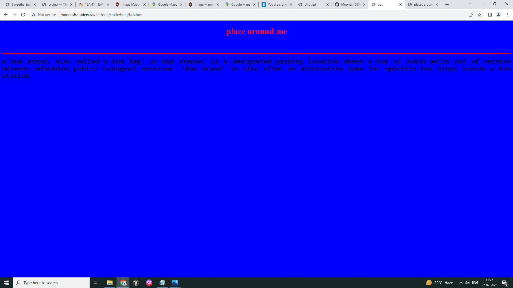
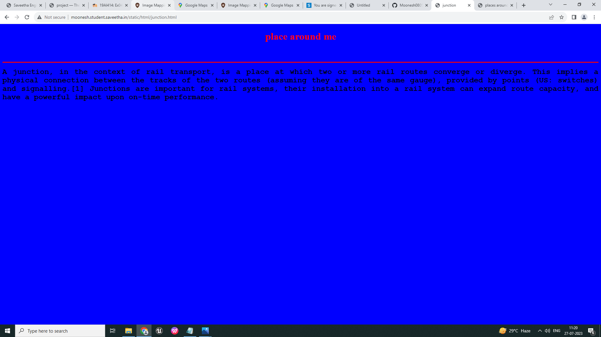
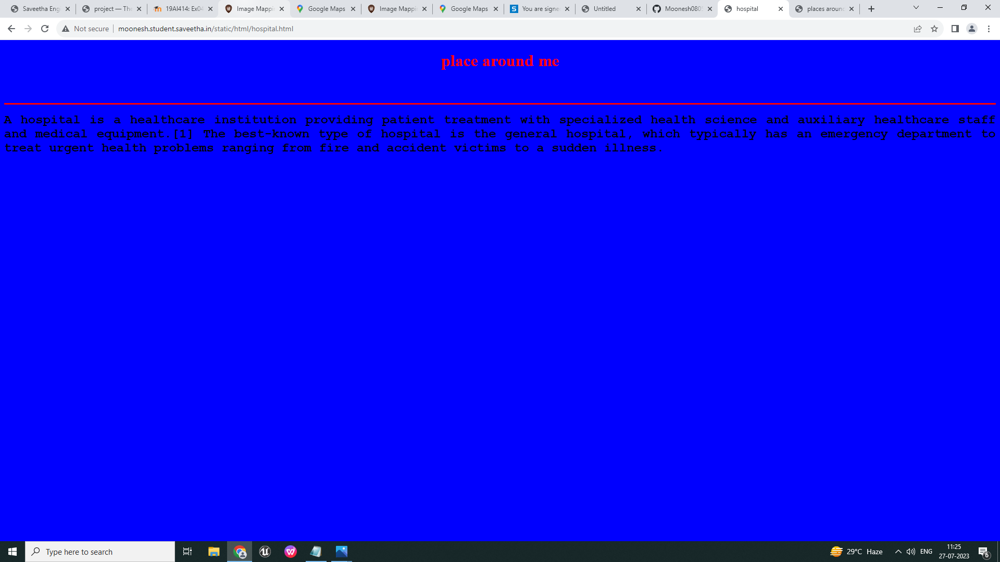
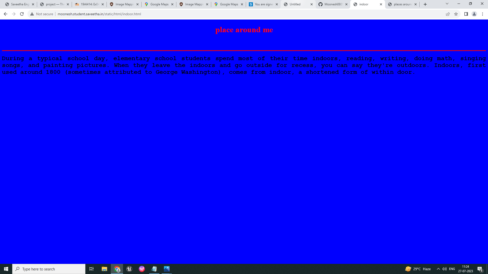

# Places Around Me
## AIM:
To develop a website to display details about the places around my house.

## Design Steps:

### Step 1:
Write your own steps here.
### Step 2:

## Code:
```
<!DOCTYPE html>

<html lang="en">

<head>

<title>my city</title>

</head>

<body>

<body bgcolor="cyan">

<h1 align="center">

<font color="red"><b>map.png</b></font>

</h1>

<h3 align="center">

<font color="blue"><b>Moonesh (23001144)</b></font>

</h3>

<center>


<map name="MyCity">

<area  alt="" title="bus" href="bus.html" shape="rect" coords="513,441,563,491" style="outline:none;" target="_self"     />
<area  alt="" title="junction" href="junction.html" shape="rect" coords="949,604,999,654" style="outline:none;" target="_self"     />
<area  alt="" title="theatre" href="theatre.html" shape="rect" coords="1223,820,1282,873" style="outline:none;" target="_self"     />
<area  alt="" title="hospital" href="hospital.html" shape="rect" coords="841,840,900,893" style="outline:none;" target="_self"     />
<area  alt="" title="ravi indoor" href="indoor.html" shape="rect" coords="1435,869,1494,922" style="outline:none;" target="_self"     />
<area shape="rect" coords="1918,1078,1920,1080" alt="Image Map" style="outline:none;" title="Image Map" href="https://www.image-maps.com/" />
</map>

</center>

</body>

</html>

<!DOCTYPE html>

<html lang="en">

<head>

<title>junction</title>

</head>

<body bgcolor="blue">

<h1 align="center">

<font color="red"><b>place around me</b></font>

</h1>

<h3 align="center">

<font color="blue"><b>my city</b></font>

</h3>

<hr size="3" color="red">

<p align="justify">

<font face="Courier New" size="5">

<b>

 A junction, in the context of rail transport, is a place at which two or more rail routes converge or diverge. This implies a physical connection between the tracks of the two routes (assuming they are of the same gauge), provided by points (US: switches) and signalling.[1] Junctions are important for rail systems, their installation into a rail system can expand route capacity, and have a powerful impact upon on-time performance.
</b>

</font>

</p>

</body>

</html>

<!DOCTYPE html>

<html lang="en">

<head>

<title>indoor</title>

</head>

<body bgcolor="blue">

<h1 align="center">

<font color="red"><b>place around me</b></font>

</h1>

<h3 align="center">

<font color="blue"><b>my city</b></font>

</h3>

<hr size="3" color="red">

<p align="justify">

<font face="Courier New" size="5">

<b>

 During a typical school day, elementary school students spend most of their time indoors, reading, writing, doing math, singing songs, and painting pictures. When they leave the indoors and go outside for recess, you can say they're outdoors. Indoors, first used around 1800 (sometimes attributed to George Washington), comes from indoor, a shortened form of within door.

</b>

</font>

</p>

</body>

</html>

<!DOCTYPE html>

<html lang="en">

<head>

<title>hospital</title>

</head>

<body bgcolor="blue">

<h1 align="center">

<font color="red"><b>place around me</b></font>

</h1>

<h3 align="center">

<font color="blue"><b>my city</b></font>

</h3>

<hr size="3" color="red">

<p align="justify">

<font face="Courier New" size="5">

<b>

 A hospital is a healthcare institution providing patient treatment with specialized health science and auxiliary healthcare staff and medical equipment.[1] The best-known type of hospital is the general hospital, which typically has an emergency department to treat urgent health problems ranging from fire and accident victims to a sudden illness. 
</b>

</font>

</p>

</body>

</html>

<!DOCTYPE html>

<html lang="en">

<head>

<title>bus</title>

</head>

<body bgcolor="blue">

<h1 align="center">

<font color="red"><b>place around me</b></font>

</h1>

<h3 align="center">

<font color="blue"><b>my city</b></font>

</h3>

<hr size="3" color="red">


<p align="justify">

<font face="Courier New" size="5">

<b>

 A bus stand, also called a bus bay, or bus stance, is a designated parking location where a bus or coach waits out of service between scheduled public transport services. 'Bus stand' is also often an alternative name for specific bus stops inside a bus station
</b>

</font>

</p>

</body>

</html>

<!DOCTYPE html>

<html lang="en">

<head>

<title>theatre</title>

</head>

<body bgcolor="blue">

<h1 align="center">

<font color="red"><b>place around me</b></font>

</h1>

<h3 align="center">

<font color="blue"><b>my city</b></font>

</h3>

<hr size="3" color="red">


<p align="justify">

<font face="Courier New" size="5">

<b>

 Theatre or theater[a] is a collaborative form of performing art that uses live performers, usually actors or actresses, to present the experience of a real or imagined event before a live audience in a specific place, often a stage. The performers may communicate this experience to the audience through combinations of gesture, speech, song, music, and dance.
</b>

</font>

</p>

</body>

</html>
```
## Output:







## Result:
The program for implementing image map is executed sucessfully